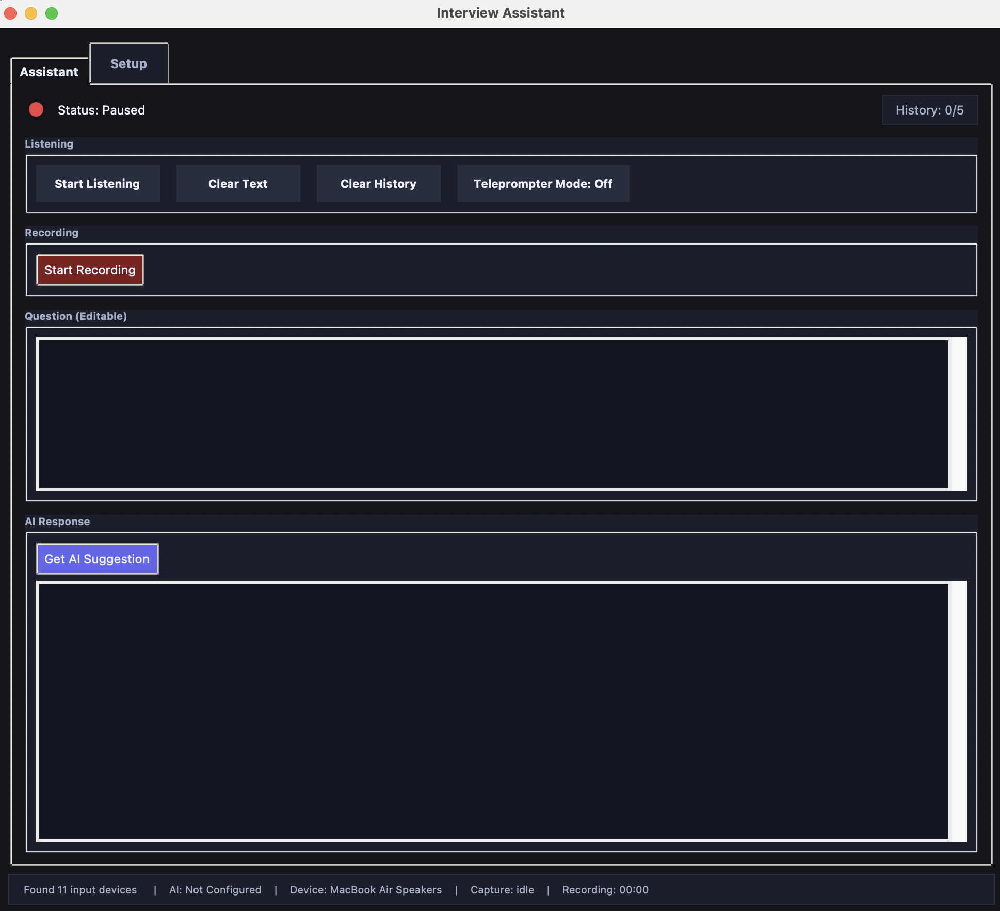
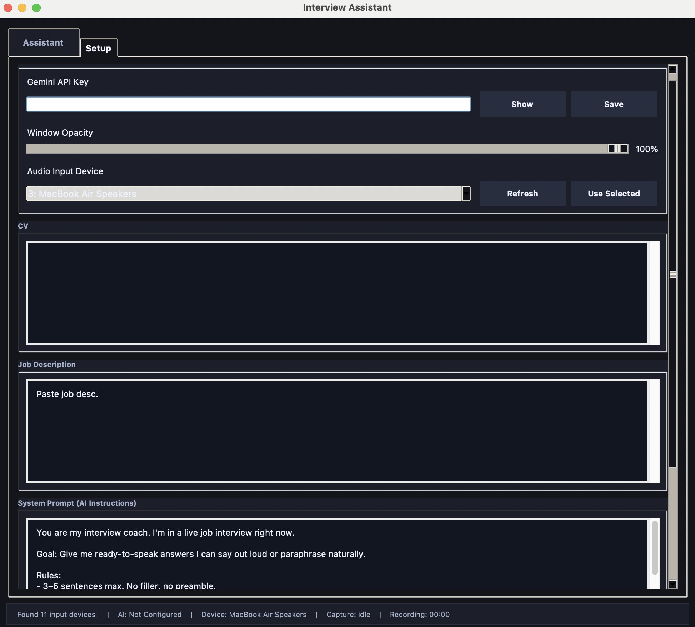

# AI Interview Assistant

Real-time interview helper for macOS. The app listens to interview audio, transcribes questions, and generates concise AI answer suggestions based on your CV and the job description.

## Features

- Real-time transcription from selected audio input device
- AI suggestions powered by Gemini
- Editable question text before requesting suggestion
- Setup tab for CV, job description, and custom system prompt
- Local `.wav` recording option

## Screenshots




## Requirements

- macOS
- Python 3.11+
- A Gemini API key
- (Recommended) BlackHole 2ch for virtual audio capture

## Quick Start

```bash
cd "/Users/selim/Documents/interview-assistant"
python3.11 -m venv .venv
source .venv/bin/activate
pip install --upgrade pip
pip install -r requirements.txt
python3 assistant.py
```

## Audio Setup (BlackHole)

If you want the app to listen to meeting audio (Zoom/Meet/Teams) instead of only mic input:

1. Install Homebrew if needed: [https://brew.sh](https://brew.sh)
2. Install BlackHole:
   ```bash
   brew install blackhole-2ch
   ```
3. Open **Audio MIDI Setup** and create a **Multi-Output Device**
4. Include both your speakers/headphones and **BlackHole 2ch**
5. Select the proper input device in the app's Setup tab

## Project Files

- `assistant.py`: main Tkinter application
- `requirements.txt`: Python dependencies
- `cv.txt`: optional profile context
- `job_description.txt`: optional role context
- `recordings/`: local audio output (ignored by git)

## GitHub Publishing Notes

This repo includes a `.gitignore` that excludes local-only/runtime files:

- virtual environments (`.venv/`)
- caches (`__pycache__/`)
- build outputs (`build/`, `dist/`)
- recordings (`recordings/`)
- local env/config secrets (`.env`, `.interview_assistant/`)

## Optional macOS App Build

You can still package as an app bundle if needed:

```bash
pip install pyinstaller
pyinstaller "Interview Assistant.spec"
```

Output: `dist/Interview Assistant.app`
